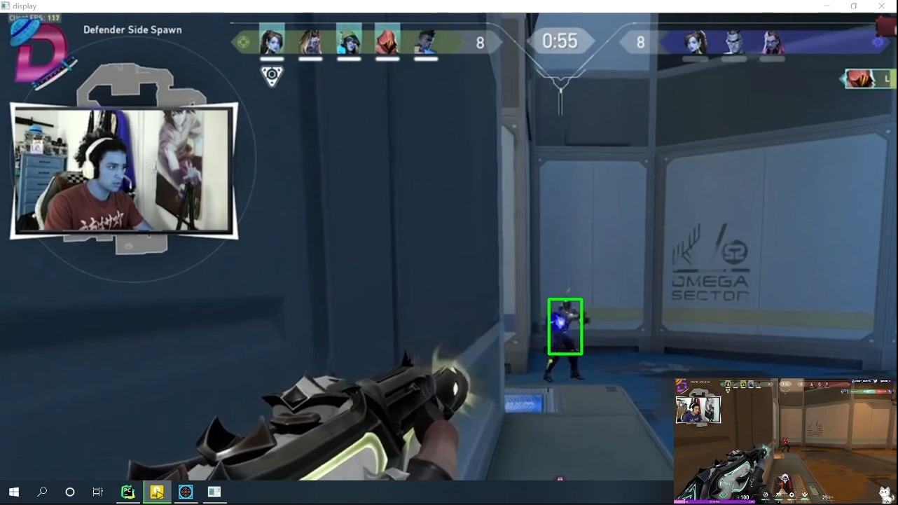

# RAED ME


[Video display](https://www.bilibili.com/video/BV1xY4y1M75D/)
## Introduction

FIRSTLY, this is a project ***only for learning using***.

It can only detect enemy not really moving mouse in game.

The algorithm is using [yolov5](https://github.com/ultralytics/yolov5)

The trained data I used mine firstly but result not good enough because label all imgs need a lot of time. So It comes from [Cool Guy Leaf48](https://github.com/Leaf48/YOLOv5-Models-For-Valorant).

I tried to transfer it int onnx and use opencv + cpp to do detect but actually fps is slower than in python. I don't really get the reason. But I guess it is because the API I used in cpp is not as fast as it in pytorch.

## Function
When you click left button, it will automatically detect enemy place and move mouse to there.

## learning
1. show the detected image with box, when click mouse your cursor will move to the box.
```
python develop.py 
```

2. Not show the detected box and have different ways to realize move mouse.
```
python main.py
```

## parameters
* rect: based on the resolution of your screen. The rect is the rectangle in your screen.
(leftTop_x, leftTop_y, rightBot_x, rightBot_y)

* pid: the process Id of the game which can be seen in Task Manager.

## issue
1. The test image is looks in blue because I didn't change the BRG to RGB channel.  （**Fixed**）

But that's not a big problem.

If want to get higher precision, just need change the blue channel and red channel in the image matrix.

Of course, the lower precision is not a problem for me for learning yolo5.

2. Simple mouse control function not work for Valorant.
If really want to cheat, we need use better technology. For example, in arduino we can use mouse.move() to simulate real mouse moving.

Or we need insert a data stream before system send msg to valorant.

But of course, it maybe also the problem that I didn't find the real HWND of valorant. Because the window of Valorant named as "Unreal" valorant window.
